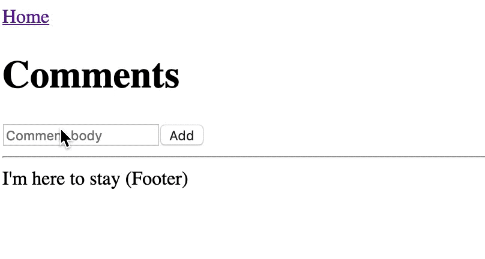

Next.js with WatermelonDB
==========================

> Example of [Next.js](https://github.com/zeit/next.js) with [WatermelonDB](https://github.com/Nozbe/WatermelonDB).

*Typescript is also setup but you don't need to use that...*

### Demo




I created this as there were no examples of how to get WatermelonDB working with Next.js.

There are some specific tweaks you need to make this work with Next. Mainly the loader (worker-loader) and the additional `DatabaseProvider` setup under `pages/_app.tsx`.

This example is pretty crude. It was mostly just for me to play with WatermelonDB so don't expect a scalable and well designed scaffold.

### Setup

```
npm install
npm run dev
```

Then open `http://localhost:3000`.

